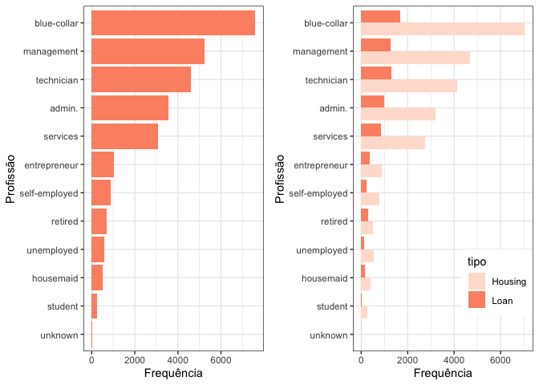
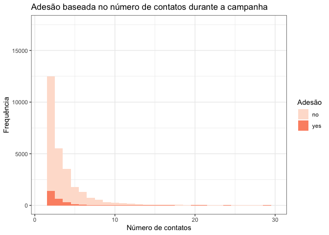
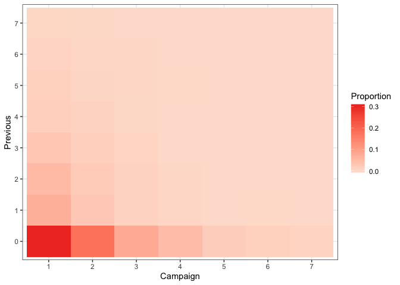
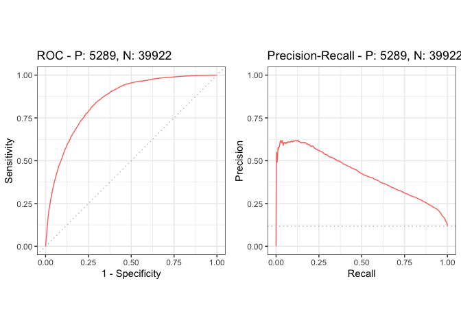
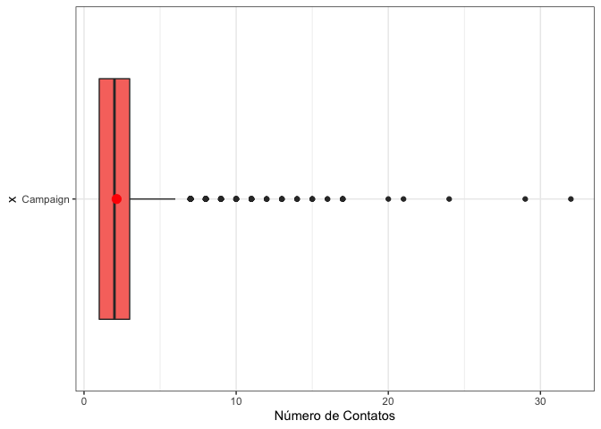
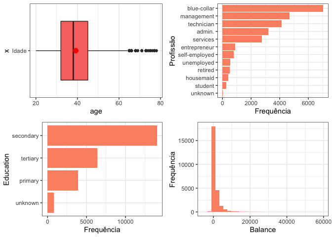

# Questões

### 1. Qual profissão tem mais tendência a fazer um empréstimo? De qual tipo? 

<p style="text-align:justify; font-size:18px;">
Podemos analisar descritivamente  o número de empréstimos feitos em cada profissão. Para isso, olhemos a tabela de frequência absoluta relacionada a essa variável.</p>


<div style="border: 1px solid #ddd; padding: 0px; overflow-y: scroll; height:250px; "><table class="table table-striped" style="width: auto !important; margin-left: auto; margin-right: auto;">
 <thead>
  <tr>
   <th style="text-align:left;position: sticky; top:0; background-color: #FFFFFF;"> Variável </th>
   <th style="text-align:right;position: sticky; top:0; background-color: #FFFFFF;"> Frequência </th>
  </tr>
 </thead>
<tbody>
  <tr>
   <td style="text-align:left;"> admin. </td>
   <td style="text-align:right;"> 5171 </td>
  </tr>
  <tr>
   <td style="text-align:left;"> blue-collar </td>
   <td style="text-align:right;"> 9732 </td>
  </tr>
  <tr>
   <td style="text-align:left;"> entrepreneur </td>
   <td style="text-align:right;"> 1487 </td>
  </tr>
  <tr>
   <td style="text-align:left;"> housemaid </td>
   <td style="text-align:right;"> 1240 </td>
  </tr>
  <tr>
   <td style="text-align:left;"> management </td>
   <td style="text-align:right;"> 9458 </td>
  </tr>
  <tr>
   <td style="text-align:left;"> retired </td>
   <td style="text-align:right;"> 2264 </td>
  </tr>
  <tr>
   <td style="text-align:left;"> self-employed </td>
   <td style="text-align:right;"> 1579 </td>
  </tr>
  <tr>
   <td style="text-align:left;"> services </td>
   <td style="text-align:right;"> 4154 </td>
  </tr>
  <tr>
   <td style="text-align:left;"> student </td>
   <td style="text-align:right;"> 938 </td>
  </tr>
  <tr>
   <td style="text-align:left;"> technician </td>
   <td style="text-align:right;"> 7597 </td>
  </tr>
  <tr>
   <td style="text-align:left;"> unemployed </td>
   <td style="text-align:right;"> 1303 </td>
  </tr>
  <tr>
   <td style="text-align:left;"> unknown </td>
   <td style="text-align:right;"> 288 </td>
  </tr>
</tbody>
</table></div>
<br>
<p style="text-align:justify; font-size:18px;">
Uma maneira mais clara de observar as frequências é por meio de um gráfico de barras.
</p>
<br>


<p style="text-align:justify; font-size:18px;">
Pelos gráficos, notamos que blue-collar é a profissão que mais realiza empréstimos e o tipo de empréstimo predominante é Housing. 
</p>

### 2. Fazendo uma relação entre número de contatos e sucesso da campanha quais são os pontos relevantes a serem observados?
<p style="text-align:justify; font-size:18px;">
Considerando apenas o número de contatos durante a campanha atual, observemos no gráfico abaixo que o maior número de adesão ocorre quando o cliente é contatado poucas vezes, menos que 5 vezes. O eixo horizontal do gráfico foi reduzido ao intervalo (0,30] pois a frequência para valores acima de 30 contatos não se mostrou relevante.
</p>




<p style="text-align:justify; font-size:18px;">
Adicionalmente, podemos  avaliar se contatos realizados previamente influenciam na adesão do cliente. Inicialmente, comparemos os decis da distribuição das variáveis "Campain" e "Previous", considerando apenas os clientes que responderam "sim" à adesão. Notemos que 90% dos contatos foram menores que 4 tanto na campanha atual quanto previamente. 
</p>
<table class="table table-striped" style="margin-left: auto; margin-right: auto;">
 <thead>
<tr>
<th style="border-bottom:hidden" colspan="1"></th>
<th style="border-bottom:hidden; padding-bottom:0; padding-left:3px;padding-right:3px;text-align: center; " colspan="10"><div style="border-bottom: 1px solid #ddd; padding-bottom: 5px; ">Percentiles</div></th>
</tr>
  <tr>
   <th style="text-align:left;">   </th>
   <th style="text-align:right;"> 10% </th>
   <th style="text-align:right;"> 20% </th>
   <th style="text-align:right;"> 30% </th>
   <th style="text-align:right;"> 40% </th>
   <th style="text-align:right;"> 50% </th>
   <th style="text-align:right;"> 60% </th>
   <th style="text-align:right;"> 70% </th>
   <th style="text-align:right;"> 80% </th>
   <th style="text-align:right;"> 90% </th>
   <th style="text-align:right;"> 100% </th>
  </tr>
 </thead>
<tbody>
  <tr>
   <td style="text-align:left;"> Campaign </td>
   <td style="text-align:right;"> 1 </td>
   <td style="text-align:right;"> 1 </td>
   <td style="text-align:right;"> 1 </td>
   <td style="text-align:right;"> 1 </td>
   <td style="text-align:right;"> 2 </td>
   <td style="text-align:right;"> 2 </td>
   <td style="text-align:right;"> 2 </td>
   <td style="text-align:right;"> 3 </td>
   <td style="text-align:right;"> 4 </td>
   <td style="text-align:right;"> 32 </td>
  </tr>
  <tr>
   <td style="text-align:left;"> Previous </td>
   <td style="text-align:right;"> 0 </td>
   <td style="text-align:right;"> 0 </td>
   <td style="text-align:right;"> 0 </td>
   <td style="text-align:right;"> 0 </td>
   <td style="text-align:right;"> 0 </td>
   <td style="text-align:right;"> 0 </td>
   <td style="text-align:right;"> 1 </td>
   <td style="text-align:right;"> 2 </td>
   <td style="text-align:right;"> 4 </td>
   <td style="text-align:right;"> 58 </td>
  </tr>
</tbody>
</table>

<p style="text-align:justify; font-size:18px;">
No gráfico abaixo mostramos simultaneamente o numero de contatos em campanhas anteriores e atual. Observa-se que a maior proporção de contatos ocorre quando contatos prévios não têm sido feitos, frequentemente só se faz contato na campanha atual.
</p>


<p style="text-align:justify; font-size:18px;">
Até este momento, a análise dos dados foi apenas exploratória. Com o objetivo de realizar uma análise inferencial e dado que a natureza da variável de interesse (adesão) é binária, utilizaremos um modelo de regressão logístico para ajustar os dados e avaliar a relação entre as variáveis. Consideramos o modelo logístico porque, neste momento, estamos interessados principalmente na interpretabilidade dos parâmetros. Primeiramente foi ajustado um modelo sem considerar as variáveis socio-econômicas. Utilizamos o critério AIC (*Akaike information criterion*) e temos as estimativas, os respectivos erros-padrão e os valores descritivos do teste apresentados na tabela abaixo.
</p>
<table class="table table-striped" style="margin-left: auto; margin-right: auto;">
 <thead>
<tr>
<th style="border-bottom:hidden" colspan="1"></th>
<th style="border-bottom:hidden; padding-bottom:0; padding-left:3px;padding-right:3px;text-align: center; " colspan="4"><div style="border-bottom: 1px solid #ddd; padding-bottom: 5px; ">Logistic model output</div></th>
</tr>
  <tr>
   <th style="text-align:left;">   </th>
   <th style="text-align:right;"> Estimate </th>
   <th style="text-align:right;"> Std. Error </th>
   <th style="text-align:right;"> z value </th>
   <th style="text-align:right;"> Pr(&gt;|z|) </th>
  </tr>
 </thead>
<tbody>
  <tr>
   <td style="text-align:left;"> (Intercept) </td>
   <td style="text-align:right;"> -2.7947440 </td>
   <td style="text-align:right;"> 0.0363328 </td>
   <td style="text-align:right;"> -76.9206496 </td>
   <td style="text-align:right;"> 0.000000 </td>
  </tr>
  <tr>
   <td style="text-align:left;"> campaign </td>
   <td style="text-align:right;"> -0.1373131 </td>
   <td style="text-align:right;"> 0.0097676 </td>
   <td style="text-align:right;"> -14.0580098 </td>
   <td style="text-align:right;"> 0.000000 </td>
  </tr>
  <tr>
   <td style="text-align:left;"> previous </td>
   <td style="text-align:right;"> 0.0735563 </td>
   <td style="text-align:right;"> 0.0073788 </td>
   <td style="text-align:right;"> 9.9686370 </td>
   <td style="text-align:right;"> 0.000000 </td>
  </tr>
  <tr>
   <td style="text-align:left;"> contacttelephone </td>
   <td style="text-align:right;"> 0.0510844 </td>
   <td style="text-align:right;"> 0.0642860 </td>
   <td style="text-align:right;"> 0.7946434 </td>
   <td style="text-align:right;"> 0.426821 </td>
  </tr>
  <tr>
   <td style="text-align:left;"> contactunknown </td>
   <td style="text-align:right;"> -1.5571252 </td>
   <td style="text-align:right;"> 0.0547739 </td>
   <td style="text-align:right;"> -28.4282148 </td>
   <td style="text-align:right;"> 0.000000 </td>
  </tr>
  <tr>
   <td style="text-align:left;"> pdays </td>
   <td style="text-align:right;"> 0.0011167 </td>
   <td style="text-align:right;"> 0.0001587 </td>
   <td style="text-align:right;"> 7.0348097 </td>
   <td style="text-align:right;"> 0.000000 </td>
  </tr>
  <tr>
   <td style="text-align:left;"> duration </td>
   <td style="text-align:right;"> 0.0037742 </td>
   <td style="text-align:right;"> 0.0000585 </td>
   <td style="text-align:right;"> 64.4964387 </td>
   <td style="text-align:right;"> 0.000000 </td>
  </tr>
</tbody>
</table>

<p style="text-align:justify; font-size:18px;">
O modelo corrobora com o observado na análise descritiva, isto é, quando o número de ligações aumenta, a probabilidade de um cliente responder "sim" à adesão, diminui. Abaixo, apresentamos a curva ROC do modelo ajustado. A acurácia do modelo é de 0.8509095.
</p>



### 3. Baseando-se nos resultados de adesão desta campanha qual o número médio e o máximo de ligações que você indica para otimizar a adesão?

<p style="text-align:justify; font-size:18px;">
Como argumentado na questão anterior, considerando a distribuição do número de ligações para os clientes que aderiram, devem ser feitas, em média, 2 ligações. Apesar do número máximo de ligações no grupo de clientes que a adesão foi positiva ter sido maior que 4, podemos observar pelo boxplot que esses valores são *outliers* (dados com comportamento diferente dos demais). Portanto, pela distribuição quantílica mostrada anteriormente e pelo boxplot apresentado, sugerimos que sejam realizadas no máximo 4 ligações. 
</p>
<table class="table table-striped" style="width: auto !important; margin-left: auto; margin-right: auto;">
 <thead>
  <tr>
   <th style="text-align:right;"> Min. </th>
   <th style="text-align:right;"> 1st Qu. </th>
   <th style="text-align:right;"> Median </th>
   <th style="text-align:right;"> Mean </th>
   <th style="text-align:right;"> 3rd Qu. </th>
   <th style="text-align:right;"> Max. </th>
  </tr>
 </thead>
<tbody>
  <tr>
   <td style="text-align:right;"> 1 </td>
   <td style="text-align:right;"> 1 </td>
   <td style="text-align:right;"> 2 </td>
   <td style="text-align:right;"> 2.141047 </td>
   <td style="text-align:right;"> 3 </td>
   <td style="text-align:right;"> 32 </td>
  </tr>
</tbody>
</table>




### 4. O resultado da campanha anterior tem relevância na campanha atual?
<p style="text-align:justify; font-size:18px;">
Para entender se a campanha anterior tem relevância na campanha atual vamos organizar os dados em uma tabela de contingência e utilizaremos o teste de Qui-quadrado para verificar se existe alguma relação entre as campanhas.
</p>

<table class="table table-striped" style="width: auto !important; margin-left: auto; margin-right: auto;">
 <thead>
<tr>
<th style="border-bottom:hidden; padding-bottom:0; padding-left:3px;padding-right:3px;text-align: center; " colspan="1"><div style="border-bottom: 1px solid #ddd; padding-bottom: 5px; ">poutcome</div></th>
<th style="border-bottom:hidden; padding-bottom:0; padding-left:3px;padding-right:3px;text-align: center; " colspan="2"><div style="border-bottom: 1px solid #ddd; padding-bottom: 5px; ">y</div></th>
</tr>
  <tr>
   <th style="text-align:left;">   </th>
   <th style="text-align:right;"> no </th>
   <th style="text-align:right;"> yes </th>
  </tr>
 </thead>
<tbody>
  <tr>
   <td style="text-align:left;"> failure </td>
   <td style="text-align:right;"> 4283 </td>
   <td style="text-align:right;"> 618 </td>
  </tr>
  <tr>
   <td style="text-align:left;"> other </td>
   <td style="text-align:right;"> 1533 </td>
   <td style="text-align:right;"> 307 </td>
  </tr>
  <tr>
   <td style="text-align:left;"> success </td>
   <td style="text-align:right;"> 533 </td>
   <td style="text-align:right;"> 978 </td>
  </tr>
  <tr>
   <td style="text-align:left;"> unknown </td>
   <td style="text-align:right;"> 33573 </td>
   <td style="text-align:right;"> 3386 </td>
  </tr>
</tbody>
</table>

```
## 
## 	Pearson's Chi-squared test
## 
## data:  .
## X-squared = 4391.5, df = 3, p-value < 2.2e-16
```

<p style="text-align:justify; font-size:18px;">
Observe que o valor-p da estatística Qui-quadrado foi significativo, considerando um nível de significância de 0.05. Consequentemente, podemos rejeitar a hipótese de independência entre as campanhas, isto é, existe associação entre o resultado da campanha atual e a campanha anterior.
</p>

## 5. Qual o fator determinante para que o banco exija um seguro de crédito?
<p style="text-align:justify; font-size:18px;">
Como informação *a priori*, sabemos que oferecer crédito a um inadimplente pode representar um risco maior para a instituição que oferece. Na situação em estudo, uma das variáveis, denominada "default", classifica os clientes em adimplente ("no") e inadimplente ("yes"). Para verificar se essa variável deve ser considerada importante, podemos, inicialmente, analisar a proporção de pessoas que estão em *default* e que aderiram à campanha. 
</p>
<br>

```
##    Cell Contents 
## |-------------------------|
## |                       N | 
## |           N / Row Total | 
## |-------------------------|
## 
## ======================================
##                  dados$y
## dados$default       no     yes   Total
## --------------------------------------
## no               39159    5237   44396
##                  0.882   0.118   0.982
## --------------------------------------
## yes                763      52     815
##                  0.936   0.064   0.018
## --------------------------------------
## Total            39922    5289   45211
## ======================================
```
<br>
<p style="text-align:justify; font-size:18px;">
Como observado na tabela anterior, quase 2% das pessoas que estão devendo, aderiram à campanha. Esta pode ser uma variável determinante para que o banco exija um seguro de crédito. Podemos ainda analisar as características dos clientes que estão em *default* por meio de um modelo de regressão. </p>
<br>
<div style="border: 1px solid #ddd; padding: 0px; overflow-y: scroll; height:250px; "><table class="table table-striped" style="margin-left: auto; margin-right: auto;">
 <thead>
<tr>
<th style="border-bottom:hiddenposition: sticky; top:0; background-color: #FFFFFF;" colspan="1"></th>
<th style="border-bottom:hidden; padding-bottom:0; padding-left:3px;padding-right:3px;text-align: center; position: sticky; top:0; background-color: #FFFFFF;" colspan="4"><div style="border-bottom: 1px solid #ddd; padding-bottom: 5px; ">Logistic model output</div></th>
</tr>
  <tr>
   <th style="text-align:left;position: sticky; top:0; background-color: #FFFFFF;">   </th>
   <th style="text-align:right;position: sticky; top:0; background-color: #FFFFFF;"> Estimate </th>
   <th style="text-align:right;position: sticky; top:0; background-color: #FFFFFF;"> Std. Error </th>
   <th style="text-align:right;position: sticky; top:0; background-color: #FFFFFF;"> z value </th>
   <th style="text-align:right;position: sticky; top:0; background-color: #FFFFFF;"> Pr(&gt;|z|) </th>
  </tr>
 </thead>
<tbody>
  <tr>
   <td style="text-align:left;"> (Intercept) </td>
   <td style="text-align:right;"> -3.4537331 </td>
   <td style="text-align:right;"> 0.3365371 </td>
   <td style="text-align:right;"> -10.2625635 </td>
   <td style="text-align:right;"> 0.0000000 </td>
  </tr>
  <tr>
   <td style="text-align:left;"> age </td>
   <td style="text-align:right;"> -0.0136958 </td>
   <td style="text-align:right;"> 0.0047039 </td>
   <td style="text-align:right;"> -2.9115760 </td>
   <td style="text-align:right;"> 0.0035961 </td>
  </tr>
  <tr>
   <td style="text-align:left;"> jobblue-collar </td>
   <td style="text-align:right;"> 0.4399556 </td>
   <td style="text-align:right;"> 0.1463997 </td>
   <td style="text-align:right;"> 3.0051679 </td>
   <td style="text-align:right;"> 0.0026543 </td>
  </tr>
  <tr>
   <td style="text-align:left;"> jobentrepreneur </td>
   <td style="text-align:right;"> 1.1547622 </td>
   <td style="text-align:right;"> 0.1936052 </td>
   <td style="text-align:right;"> 5.9645221 </td>
   <td style="text-align:right;"> 0.0000000 </td>
  </tr>
  <tr>
   <td style="text-align:left;"> jobhousemaid </td>
   <td style="text-align:right;"> 0.4520776 </td>
   <td style="text-align:right;"> 0.2599264 </td>
   <td style="text-align:right;"> 1.7392524 </td>
   <td style="text-align:right;"> 0.0819904 </td>
  </tr>
  <tr>
   <td style="text-align:left;"> jobmanagement </td>
   <td style="text-align:right;"> 0.6236029 </td>
   <td style="text-align:right;"> 0.1668081 </td>
   <td style="text-align:right;"> 3.7384452 </td>
   <td style="text-align:right;"> 0.0001852 </td>
  </tr>
  <tr>
   <td style="text-align:left;"> jobretired </td>
   <td style="text-align:right;"> 0.3232468 </td>
   <td style="text-align:right;"> 0.2506367 </td>
   <td style="text-align:right;"> 1.2897027 </td>
   <td style="text-align:right;"> 0.1971539 </td>
  </tr>
  <tr>
   <td style="text-align:left;"> jobself-employed </td>
   <td style="text-align:right;"> 0.7038802 </td>
   <td style="text-align:right;"> 0.2273264 </td>
   <td style="text-align:right;"> 3.0963415 </td>
   <td style="text-align:right;"> 0.0019592 </td>
  </tr>
  <tr>
   <td style="text-align:left;"> jobservices </td>
   <td style="text-align:right;"> 0.1163109 </td>
   <td style="text-align:right;"> 0.1699711 </td>
   <td style="text-align:right;"> 0.6842977 </td>
   <td style="text-align:right;"> 0.4937872 </td>
  </tr>
  <tr>
   <td style="text-align:left;"> jobstudent </td>
   <td style="text-align:right;"> -1.2002647 </td>
   <td style="text-align:right;"> 0.5975856 </td>
   <td style="text-align:right;"> -2.0085234 </td>
   <td style="text-align:right;"> 0.0445877 </td>
  </tr>
  <tr>
   <td style="text-align:left;"> jobtechnician </td>
   <td style="text-align:right;"> 0.1748386 </td>
   <td style="text-align:right;"> 0.1519070 </td>
   <td style="text-align:right;"> 1.1509580 </td>
   <td style="text-align:right;"> 0.2497495 </td>
  </tr>
  <tr>
   <td style="text-align:left;"> jobunemployed </td>
   <td style="text-align:right;"> 0.8434172 </td>
   <td style="text-align:right;"> 0.2266461 </td>
   <td style="text-align:right;"> 3.7212957 </td>
   <td style="text-align:right;"> 0.0001982 </td>
  </tr>
  <tr>
   <td style="text-align:left;"> jobunknown </td>
   <td style="text-align:right;"> -0.2335886 </td>
   <td style="text-align:right;"> 0.7311575 </td>
   <td style="text-align:right;"> -0.3194778 </td>
   <td style="text-align:right;"> 0.7493642 </td>
  </tr>
  <tr>
   <td style="text-align:left;"> maritalmarried </td>
   <td style="text-align:right;"> -0.3717964 </td>
   <td style="text-align:right;"> 0.1075286 </td>
   <td style="text-align:right;"> -3.4576516 </td>
   <td style="text-align:right;"> 0.0005449 </td>
  </tr>
  <tr>
   <td style="text-align:left;"> maritalsingle </td>
   <td style="text-align:right;"> -0.1189620 </td>
   <td style="text-align:right;"> 0.1252875 </td>
   <td style="text-align:right;"> -0.9495125 </td>
   <td style="text-align:right;"> 0.3423600 </td>
  </tr>
  <tr>
   <td style="text-align:left;"> educationsecondary </td>
   <td style="text-align:right;"> 0.0135569 </td>
   <td style="text-align:right;"> 0.1149179 </td>
   <td style="text-align:right;"> 0.1179706 </td>
   <td style="text-align:right;"> 0.9060910 </td>
  </tr>
  <tr>
   <td style="text-align:left;"> educationtertiary </td>
   <td style="text-align:right;"> -0.4033419 </td>
   <td style="text-align:right;"> 0.1511081 </td>
   <td style="text-align:right;"> -2.6692278 </td>
   <td style="text-align:right;"> 0.0076026 </td>
  </tr>
  <tr>
   <td style="text-align:left;"> educationunknown </td>
   <td style="text-align:right;"> 0.1699570 </td>
   <td style="text-align:right;"> 0.2104657 </td>
   <td style="text-align:right;"> 0.8075283 </td>
   <td style="text-align:right;"> 0.4193622 </td>
  </tr>
  <tr>
   <td style="text-align:left;"> balance </td>
   <td style="text-align:right;"> -0.0022060 </td>
   <td style="text-align:right;"> 0.0000839 </td>
   <td style="text-align:right;"> -26.2890738 </td>
   <td style="text-align:right;"> 0.0000000 </td>
  </tr>
  <tr>
   <td style="text-align:left;"> housingyes </td>
   <td style="text-align:right;"> -0.4736922 </td>
   <td style="text-align:right;"> 0.0807300 </td>
   <td style="text-align:right;"> -5.8676074 </td>
   <td style="text-align:right;"> 0.0000000 </td>
  </tr>
  <tr>
   <td style="text-align:left;"> loanyes </td>
   <td style="text-align:right;"> 0.6876924 </td>
   <td style="text-align:right;"> 0.0793027 </td>
   <td style="text-align:right;"> 8.6717378 </td>
   <td style="text-align:right;"> 0.0000000 </td>
  </tr>
  <tr>
   <td style="text-align:left;"> campaign </td>
   <td style="text-align:right;"> 0.0186952 </td>
   <td style="text-align:right;"> 0.0095475 </td>
   <td style="text-align:right;"> 1.9581272 </td>
   <td style="text-align:right;"> 0.0502151 </td>
  </tr>
  <tr>
   <td style="text-align:left;"> contacttelephone </td>
   <td style="text-align:right;"> -0.4136103 </td>
   <td style="text-align:right;"> 0.2079408 </td>
   <td style="text-align:right;"> -1.9890767 </td>
   <td style="text-align:right;"> 0.0466927 </td>
  </tr>
  <tr>
   <td style="text-align:left;"> contactunknown </td>
   <td style="text-align:right;"> 0.1254299 </td>
   <td style="text-align:right;"> 0.0838721 </td>
   <td style="text-align:right;"> 1.4954895 </td>
   <td style="text-align:right;"> 0.1347868 </td>
  </tr>
  <tr>
   <td style="text-align:left;"> poutcomeother </td>
   <td style="text-align:right;"> 0.0899216 </td>
   <td style="text-align:right;"> 0.3050175 </td>
   <td style="text-align:right;"> 0.2948081 </td>
   <td style="text-align:right;"> 0.7681405 </td>
  </tr>
  <tr>
   <td style="text-align:left;"> poutcomesuccess </td>
   <td style="text-align:right;"> -1.2914283 </td>
   <td style="text-align:right;"> 0.7283730 </td>
   <td style="text-align:right;"> -1.7730314 </td>
   <td style="text-align:right;"> 0.0762235 </td>
  </tr>
  <tr>
   <td style="text-align:left;"> poutcomeunknown </td>
   <td style="text-align:right;"> 0.5947911 </td>
   <td style="text-align:right;"> 0.1726368 </td>
   <td style="text-align:right;"> 3.4453325 </td>
   <td style="text-align:right;"> 0.0005704 </td>
  </tr>
</tbody>
</table></div>

## 6. Quais são as características mais proeminentes de um cliente que possua empréstimo imobiliário?
<p style="text-align:justify; font-size:18px;">
Novamente, como nosso interesse é especialmente interpretar as variáveis, utilizaremos um modelo logístico. A variável resposta que desejamos entender é "housing", de natureza binária, e assume "yes" se o cliente fez empréstimo imobiliário e "no" caso contrário.
</p><br>
<div style="border: 1px solid #ddd; padding: 0px; overflow-y: scroll; height:200px; "><table class="table table-striped" style="margin-left: auto; margin-right: auto;">
 <thead>
<tr>
<th style="border-bottom:hiddenposition: sticky; top:0; background-color: #FFFFFF;" colspan="1"></th>
<th style="border-bottom:hidden; padding-bottom:0; padding-left:3px;padding-right:3px;text-align: center; position: sticky; top:0; background-color: #FFFFFF;" colspan="4"><div style="border-bottom: 1px solid #ddd; padding-bottom: 5px; ">Logistic model output</div></th>
</tr>
  <tr>
   <th style="text-align:left;position: sticky; top:0; background-color: #FFFFFF;">   </th>
   <th style="text-align:right;position: sticky; top:0; background-color: #FFFFFF;"> Estimate </th>
   <th style="text-align:right;position: sticky; top:0; background-color: #FFFFFF;"> Std. Error </th>
   <th style="text-align:right;position: sticky; top:0; background-color: #FFFFFF;"> z value </th>
   <th style="text-align:right;position: sticky; top:0; background-color: #FFFFFF;"> Pr(&gt;|z|) </th>
  </tr>
 </thead>
<tbody>
  <tr>
   <td style="text-align:left;"> (Intercept) </td>
   <td style="text-align:right;"> 2.3033381 </td>
   <td style="text-align:right;"> 0.0772968 </td>
   <td style="text-align:right;"> 29.7986227 </td>
   <td style="text-align:right;"> 0.0000000 </td>
  </tr>
  <tr>
   <td style="text-align:left;"> age </td>
   <td style="text-align:right;"> -0.0396272 </td>
   <td style="text-align:right;"> 0.0012310 </td>
   <td style="text-align:right;"> -32.1904176 </td>
   <td style="text-align:right;"> 0.0000000 </td>
  </tr>
  <tr>
   <td style="text-align:left;"> jobblue-collar </td>
   <td style="text-align:right;"> 0.4959870 </td>
   <td style="text-align:right;"> 0.0390221 </td>
   <td style="text-align:right;"> 12.7104087 </td>
   <td style="text-align:right;"> 0.0000000 </td>
  </tr>
  <tr>
   <td style="text-align:left;"> jobentrepreneur </td>
   <td style="text-align:right;"> 0.0542613 </td>
   <td style="text-align:right;"> 0.0623913 </td>
   <td style="text-align:right;"> 0.8696938 </td>
   <td style="text-align:right;"> 0.3844678 </td>
  </tr>
  <tr>
   <td style="text-align:left;"> jobhousemaid </td>
   <td style="text-align:right;"> -1.0183056 </td>
   <td style="text-align:right;"> 0.0703054 </td>
   <td style="text-align:right;"> -14.4840290 </td>
   <td style="text-align:right;"> 0.0000000 </td>
  </tr>
  <tr>
   <td style="text-align:left;"> jobmanagement </td>
   <td style="text-align:right;"> -0.2299873 </td>
   <td style="text-align:right;"> 0.0415340 </td>
   <td style="text-align:right;"> -5.5373221 </td>
   <td style="text-align:right;"> 0.0000000 </td>
  </tr>
  <tr>
   <td style="text-align:left;"> jobretired </td>
   <td style="text-align:right;"> -0.9831131 </td>
   <td style="text-align:right;"> 0.0638156 </td>
   <td style="text-align:right;"> -15.4055334 </td>
   <td style="text-align:right;"> 0.0000000 </td>
  </tr>
  <tr>
   <td style="text-align:left;"> jobself-employed </td>
   <td style="text-align:right;"> -0.3686920 </td>
   <td style="text-align:right;"> 0.0602780 </td>
   <td style="text-align:right;"> -6.1165287 </td>
   <td style="text-align:right;"> 0.0000000 </td>
  </tr>
  <tr>
   <td style="text-align:left;"> jobservices </td>
   <td style="text-align:right;"> 0.1697127 </td>
   <td style="text-align:right;"> 0.0443201 </td>
   <td style="text-align:right;"> 3.8292507 </td>
   <td style="text-align:right;"> 0.0001285 </td>
  </tr>
  <tr>
   <td style="text-align:left;"> jobstudent </td>
   <td style="text-align:right;"> -1.6966824 </td>
   <td style="text-align:right;"> 0.0822551 </td>
   <td style="text-align:right;"> -20.6270732 </td>
   <td style="text-align:right;"> 0.0000000 </td>
  </tr>
  <tr>
   <td style="text-align:left;"> jobtechnician </td>
   <td style="text-align:right;"> -0.2555902 </td>
   <td style="text-align:right;"> 0.0375487 </td>
   <td style="text-align:right;"> -6.8068985 </td>
   <td style="text-align:right;"> 0.0000000 </td>
  </tr>
  <tr>
   <td style="text-align:left;"> jobunemployed </td>
   <td style="text-align:right;"> -0.7165380 </td>
   <td style="text-align:right;"> 0.0644637 </td>
   <td style="text-align:right;"> -11.1153758 </td>
   <td style="text-align:right;"> 0.0000000 </td>
  </tr>
  <tr>
   <td style="text-align:left;"> jobunknown </td>
   <td style="text-align:right;"> -2.4032246 </td>
   <td style="text-align:right;"> 0.2101778 </td>
   <td style="text-align:right;"> -11.4342442 </td>
   <td style="text-align:right;"> 0.0000000 </td>
  </tr>
  <tr>
   <td style="text-align:left;"> maritalmarried </td>
   <td style="text-align:right;"> -0.1444884 </td>
   <td style="text-align:right;"> 0.0325773 </td>
   <td style="text-align:right;"> -4.4352423 </td>
   <td style="text-align:right;"> 0.0000092 </td>
  </tr>
  <tr>
   <td style="text-align:left;"> maritalsingle </td>
   <td style="text-align:right;"> -0.4952222 </td>
   <td style="text-align:right;"> 0.0376032 </td>
   <td style="text-align:right;"> -13.1696756 </td>
   <td style="text-align:right;"> 0.0000000 </td>
  </tr>
  <tr>
   <td style="text-align:left;"> educationsecondary </td>
   <td style="text-align:right;"> 0.0420210 </td>
   <td style="text-align:right;"> 0.0334139 </td>
   <td style="text-align:right;"> 1.2575914 </td>
   <td style="text-align:right;"> 0.2085396 </td>
  </tr>
  <tr>
   <td style="text-align:left;"> educationtertiary </td>
   <td style="text-align:right;"> -0.2634481 </td>
   <td style="text-align:right;"> 0.0407659 </td>
   <td style="text-align:right;"> -6.4624564 </td>
   <td style="text-align:right;"> 0.0000000 </td>
  </tr>
  <tr>
   <td style="text-align:left;"> educationunknown </td>
   <td style="text-align:right;"> -0.2544425 </td>
   <td style="text-align:right;"> 0.0588443 </td>
   <td style="text-align:right;"> -4.3239966 </td>
   <td style="text-align:right;"> 0.0000153 </td>
  </tr>
  <tr>
   <td style="text-align:left;"> balance </td>
   <td style="text-align:right;"> -0.0000248 </td>
   <td style="text-align:right;"> 0.0000036 </td>
   <td style="text-align:right;"> -6.8891758 </td>
   <td style="text-align:right;"> 0.0000000 </td>
  </tr>
  <tr>
   <td style="text-align:left;"> defaultyes </td>
   <td style="text-align:right;"> -0.2946169 </td>
   <td style="text-align:right;"> 0.0745289 </td>
   <td style="text-align:right;"> -3.9530545 </td>
   <td style="text-align:right;"> 0.0000772 </td>
  </tr>
  <tr>
   <td style="text-align:left;"> loanyes </td>
   <td style="text-align:right;"> 0.0724045 </td>
   <td style="text-align:right;"> 0.0277425 </td>
   <td style="text-align:right;"> 2.6098741 </td>
   <td style="text-align:right;"> 0.0090576 </td>
  </tr>
</tbody>
</table></div>
<br>
<p style="text-align:justify; font-size:18px;">
Baseados nesse modelo, apresentamos abaixo alguns gráficos descritivos dos clientes que possuem empréstimo imobiliário.
</p>
<br>



<br>
<p style="text-align:justify; font-size:18px;">
Dos clientes que possuem um empréstimo imobiliário podemos dizer que têm uma idade média de 39 anos, a maior proporção trabalha com blue-collar ou management, o nível educativo mais frequente é secondary e o balance médio é de 1175.
</p>
<br>
